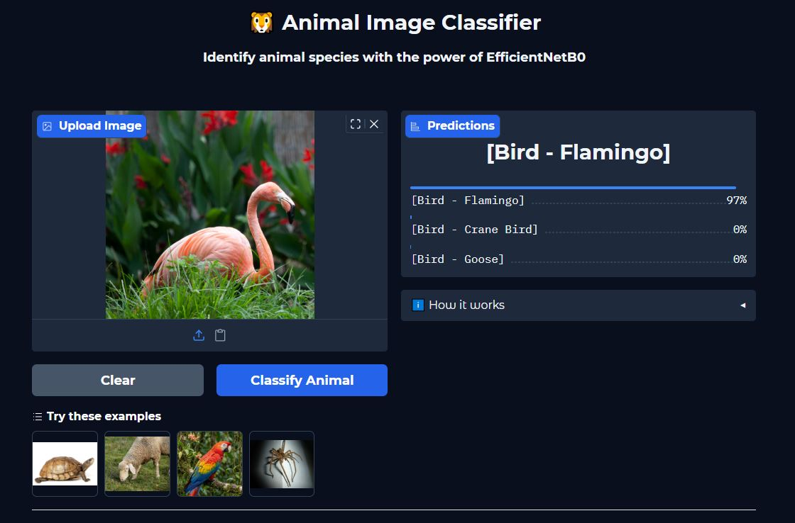
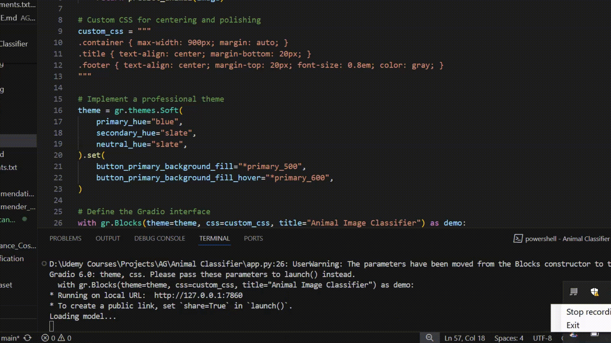

# 🦁 Animal Image Classifier


An intelligent image classification application powered by the **EfficientNetB0** model, pre-trained on ImageNet. This tool is specifically customized to identify and classify animal species, filtering out non-animal subjects to ensure focused results.

> 🚀 **Try it live:** [Launch on Hugging Face Spaces](#) *(Link will be added after deployment)*

## 📸 App Interface



## 🎥 Demo



## 🚀 Features

- **Accurate Classification**: Leveraging EfficientNetB0 for high-accuracy animal identification.
- **Top 3 Predictions**: Provides the top 3 most likely animal matches with confidence scores.
- **User-Friendly Interface**: Built with Gradio for a seamless, interactive web experience.
- **Drag & Drop**: Easily upload images via drag-and-drop or file selection.
- **Optimized Performance**: Fast inference designed to run efficiently on standard CPUs.

## ⚙️ Tech Stack

- **Python**: The core programming language.
- **PyTorch**: Deep learning framework used for the EfficientNetB0 model.
- **Gradio**: Library for building the interactive web interface.
- **Pillow (PIL)**: Python Imaging Library for image processing.
- **NumPy**: Fundamental package for numerical computations.
- **Hugging Face Spaces**: Platform for deployment and hosting.

## 🐾 Supported Categories

The model is capable of recognizing a vast array of animals from the ImageNet dataset, including:

- **Mammals**: Lions, Tigers, Bears, Elephants, Cats, Dogs, etc.
- **Birds**: Eagles, Parrots, Penguins, Owls, etc.
- **Marine Life**: Whales, Sharks, Dolphins, Fish, etc.
- **Reptiles & Amphibians**: Snakes, Turtles, Frogs, Lizards.
- **Insects**: Butterflies, Bees, Beetles.

## 🛠️ Installation

Follow these steps to set up the project locally on your machine.

### Prerequisites

- Python 3.8 or higher installed.

### Steps

1. **Clone the Repository**
```bash
   git clone https://github.com/komal-sukheja/animal-image-classifier.git
   cd animal-image-classifier
```

2. **Create Virtual Environment** (Optional but recommended)
```bash
   python -m venv classifier
   # Activate on Windows:
   classifier\Scripts\activate
   # Activate on Mac/Linux:
   source classifier/bin/activate
```

3. **Install Dependencies**
```bash
   pip install -r requirements.txt
```

## 💻 Usage

To launch the application locally:

1. **Run the App**
```bash
   python app.py
```

2. **Access the Interface**
   - The application will start and provide a local URL (usually `http://127.0.0.1:7860`).
   - Open this URL in your web browser.

3. **Classify Images**
   - Drag and drop an image into the upload box.
   - Click **Classify Animal**.
   - View the predicted animal categories and confidence scores.


## 📂 Project Structure

```
animal-image-classifier/
├── app.py              # Main application entry point (Gradio UI)
├── utils.py            # Helper functions for model inference and logic
├── requirements.txt    # List of python dependencies
├── assets/             # Media files (screenshots, demo)
│   ├── ui_screenshot.JPG
│   └── demo.gif
│   └── screenshots/    # Predictions 
├── examples/           # Example images for testing
└── README.md           # Project documentation
```

## 🤝 Contributing

Contributions are welcome! Please feel free to submit a Pull Request.

1. Fork the repository.
2. Create your feature branch (`git checkout -b feature/AmazingFeature`).
3. Commit your changes (`git commit -m 'Add some AmazingFeature'`).
4. Push to the branch (`git push origin feature/AmazingFeature`).
5. Open a Pull Request.

## 📄 License

This project is licensed under the MIT License - see the [LICENSE](LICENSE) file for details.